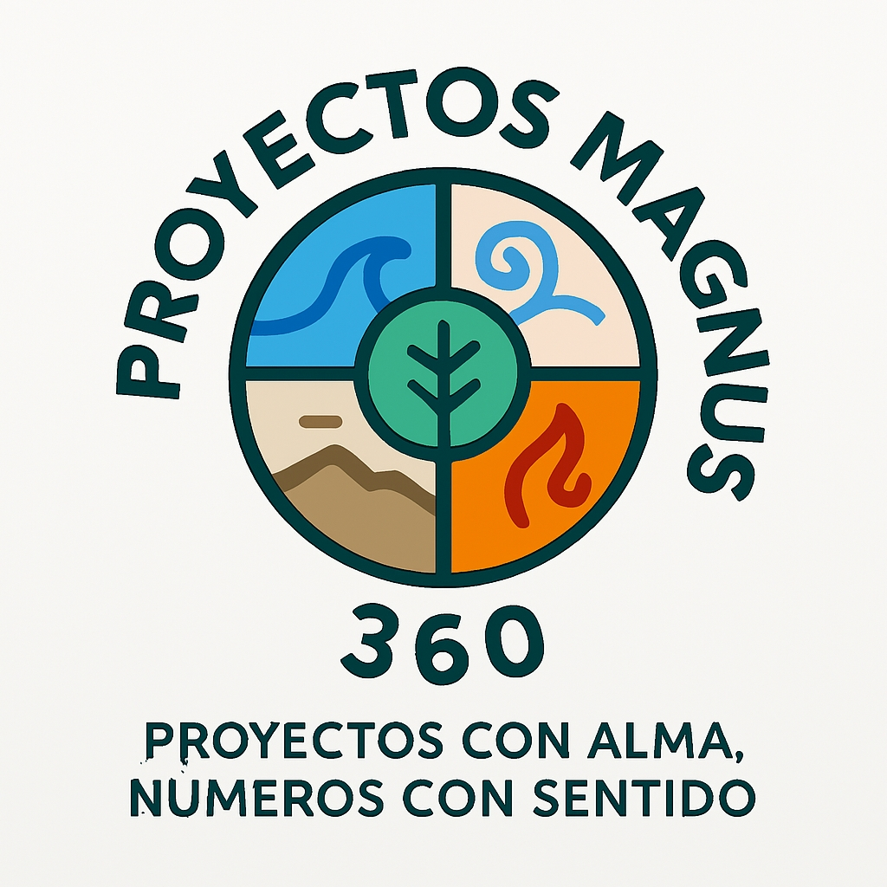
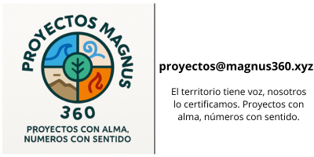

# 🌱 Proyectos Magnus 360 - Sitio Web Oficial

  

---

Bienvenido al repositorio del sitio web de **Proyectos Magnus 360**, una iniciativa de consultoría ambiental enfocada en la certificación de créditos de carbono, la estructuración territorial y la narrativa de conservación.

Este proyecto fusiona rigor técnico, claridad comunicativa y propósito simbólico para transformar reservas naturales en proyectos con impacto medible.

---

## 🚀 Propósito del sitio

El objetivo de este sitio web es comunicar de forma accesible y profesional los servicios, visión, metodología y resultados de Proyectos Magnus 360. Está estructurado para atender tanto a propietarios de reservas como a instituciones, operadores y aliados estratégicos.

La necesidad de traducir la complejidad técnica, financiera y legal de la conservación ambiental en herramientas claras, viables y justas es la génesis de Proyectos Magnus 360.
Conectamos ciencia, normativa y símbolos para que cada hectárea protegida cuente su historia… y genere impacto medible.

---

## 📊 Qué hacemos
Consultoría especializada en certificación de créditos de carbono y conservación territorial.
Diseñamos, modelamos y estructuramos proyectos bajo estándares nacionales e internacionales, con énfasis en:
- Modelos de compensación y sostenibilidad financiera
- Contratos transparentes entre propietarios, operadores y aliados
- Presentaciones ejecutivas para tomadores de decisión
- Asesoría técnica y estratégica para la acreditación de reservas

---

## 🔍 ¿Qué nos diferencia?
Rigor, claridad y sentido.
- 🧮 Modelos financieros y técnicos que anticipan escenarios
- 🎯 Comunicación accesible para todos los stakeholders
- 🌐 Narrativa digital y branding ambiental con impacto
- 🌀 Una mirada sistémica que integra lo técnico con lo simbólico
 
---
## ✨ La Filosofía Magnus 360

“La tierra no nos pertenece, nosotros pertenecemos a la tierra.”

“En lo salvaje está la preservación del mundo.”

“La biodiversidad es la verdadera riqueza de la Tierra.”

“La naturaleza no es un lugar para visitar. Es el hogar.”

“Cada flor es un alma que florece en la naturaleza.”

En Proyectos Magnus 360 creemos que cada proyecto de conservación cuenta una historia que merece ser estructurada, comunicada y transformada en impacto real.

---

## 🚀 Trabajemos juntos
¿Tienes una reserva natural, una idea o un reto de conservación?
Déjanos ayudarte a estructurarlo, comunicarlo y convertirlo en un proyecto certificado con valor real.
📩 [Contáctanos](mailto:proyectos@magnus360.com?subject=Consulta&body=Hola%2C%20quiero%20saber%20m%C3%A1s%20sobre%20sus%20servicios.)
y demos el primer paso.

---

## ✉️ Contacto

Para proyectos, colaboraciones o consultas:

  

---
*Proyectos Magnus 360*  

Correo: [proyectos@magnus360.xyz](mailto:proyectos@magnus360.com?subject=Consulta&body=Hola%2C%20quiero%20saber%20m%C3%A1s%20sobre%20sus%20servicios.)   

---

**Proyectos Magnus 360 – El territorio tiene voz, nosotros lo certificamos. Proyectos con alma, números con sentido.**

